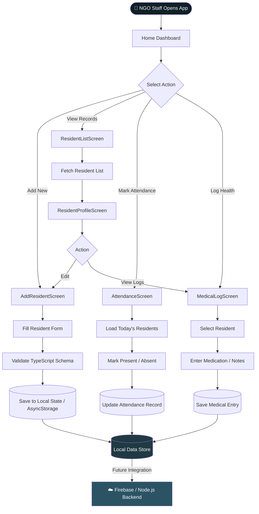
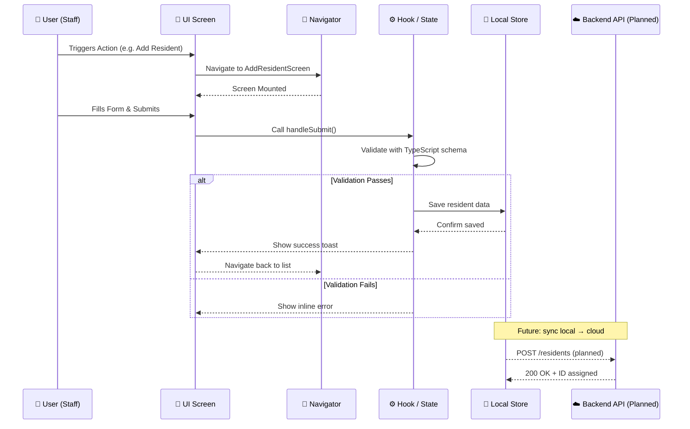
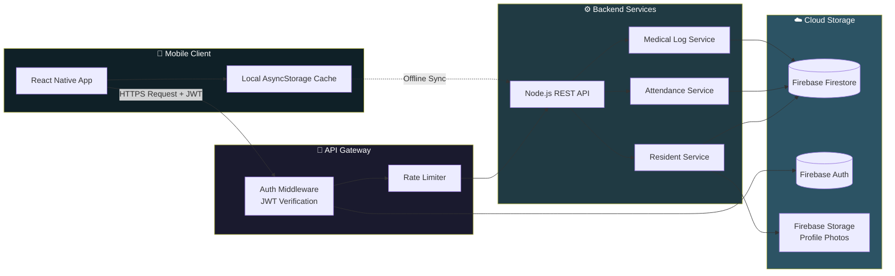

<p align="center">
  
</p>
<p align="center">
  <b>📱 Digitizing Resident Management for NGOs & Old Age Homes</b>
</p>
<p align="center">
  
  
  
  
</p>

---

## 📌 Overview

The **NGO Old Age Home Management App** is a React Native mobile application designed to digitize and streamline resident management in NGOs and old age homes.
It replaces manual registers with a structured and scalable digital system.

---

## 🚀 Current Development Status

This project is actively being improved with:
- Code refactoring
- UI improvements
- Architecture enhancements
- Future backend integration planning

📅 *Regular updates are being pushed to maintain consistency and continuous development.*

---

## 🎯 Problem Statement

Many NGOs still rely on:
- Paper-based records  
- Manual attendance  
- Disorganized medical tracking  

This causes:
- Data loss  
- Monitoring difficulty  
- Poor scalability  

This app provides a centralized digital solution.

---

## ✨ Key Features

- 👤 Add & Manage Resident Profiles  
- 📅 Attendance Tracking  
- 💊 Medical Logs  
- 📞 Emergency Contacts  
- 📊 Structured Data View  
- 📱 Clean Mobile Interface  

---

## 🧠 Core Modules

- AddResidentScreen  
- ResidentListScreen  
- ResidentProfileScreen  
- AttendanceScreen  
- MedicalLogScreen  

---

## 🏗️ System Architecture

```
┌─────────────────────────────────────────────────────────────────┐
│                     NGO MANAGEMENT APP                          │
│                   System Architecture View                      │
└─────────────────────────────────────────────────────────────────┘

  ┌──────────────────────────────────────────────────────────┐
  │                 📱 PRESENTATION LAYER                    │
  │  ┌──────────┐ ┌──────────┐ ┌──────────┐ ┌──────────┐   │
  │  │  Add     │ │Resident  │ │Attendance│ │ Medical  │   │
  │  │Resident  │ │  List    │ │ Screen   │ │   Log    │   │
  │  │ Screen   │ │ Screen   │ │          │ │  Screen  │   │
  │  └────┬─────┘ └────┬─────┘ └────┬─────┘ └────┬─────┘   │
  └───────┼────────────┼────────────┼─────────────┼─────────┘
          │            │            │             │
  ┌───────▼────────────▼────────────▼─────────────▼─────────┐
  │                 🧭 NAVIGATION LAYER                      │
  │          React Navigation — Stack & Tab Router           │
  └──────────────────────────┬──────────────────────────────┘
                             │
  ┌──────────────────────────▼──────────────────────────────┐
  │                   📦 DATA LAYER                          │
  │   Local State (useState / useContext)                    │
  │   ┌────────────────────────────────────────────────┐    │
  │   │   AsyncStorage  │  TypeScript Models  │ Hooks  │    │
  │   └────────────────────────────────────────────────┘    │
  └──────────────────────────┬──────────────────────────────┘
                             │  (Planned)
  ┌──────────────────────────▼──────────────────────────────┐
  │               ☁️ BACKEND LAYER  (Upcoming)               │
  │         Firebase / Node.js + REST API + Auth             │
  └─────────────────────────────────────────────────────────┘
```

---

## 🔄 End-to-End Processing Flow



---

## 🌐 Request Lifecycle



---

## ☁️ Cloud Execution Flow *(Planned Architecture)*



> 💡 *Cloud execution is part of the upcoming backend integration roadmap. The mobile app is being designed to be cloud-ready from day one.*

---

## 🛠 Tech Stack

- React Native  
- TypeScript  
- Expo  
- React Navigation  

---

## 🔮 Upcoming Improvements

- 🔐 Admin Authentication  
- ☁️ Firebase / Node.js Backend  
- 📊 Dashboard Analytics  
- 📤 PDF Report Export  
- 🌙 Dark Mode  

---

## 📊 Project Goal

To demonstrate how mobile technology can create **real-world social impact solutions** for NGOs and community organizations.

---

## 👨‍💻 Author

**Ravi Shankar**  
B.Tech CSE (AIML)  
AI & Full Stack Enthusiast  
GitHub: https://github.com/shanky-ux  

---

## 📜 License

MIT License

<p align="center">
  
</p>
